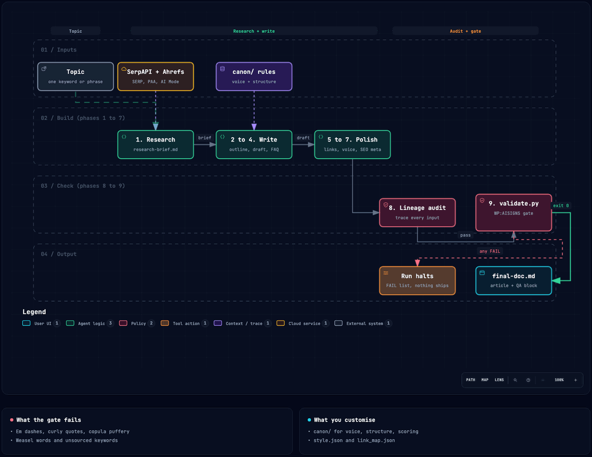

# geo-content-engine

A Claude Code skill that researches a topic, drafts an article grounded in that research, and generates artciles with 80% succes rate of being cited on major LLMs like ChatGPT, Google AI Overviews, AI Mode, etc. 

It was built and run in production on a large content site, where it generated hundreds of published articles. This is a sanitized, generic version. The `canon/` rules are examples you replace with your own brand's.

## What it does

Give it a topic. It runs nine phases end to end and writes a finished article to a local Markdown file:

1. **Research** real SERP, People-Also-Ask, Google AI Mode, competitor pages, and community threads. It never writes from the model's memory.
2. **Draft** an article grounded in that research, targeting the length and coverage the top-ranking pages actually have.
3. **Gate** the draft. If it reads like AI or breaks a canon rule, the run stops and nothing ships.

The goal is content that earns its place in AI answers (AI Overviews, ChatGPT, Perplexity) instead of content that reads like a machine wrote it.

## What makes it different: the gate

Most content tools generate. This one also refuses. `sub-skills/validate.py` is a run-halting gate: if it exits non-zero, no article is written. It is not advisory.

The gate encodes Wikipedia's field guide "Signs of AI writing" (WP:AISIGNS). A few of the tells it fails a draft on:

- **Em and en dashes.** A draft containing an em dash or en dash fails until rewritten with commas or periods.
- **Copula puffery.** "serves as", "stands as", "boasts" get rejected.
- **Weasel attribution.** "experts say", "studies suggest" with no named source fail.
- **Negative parallelism.** "not just X, but Y" is a classic tell and gets caught.
- **Curly quotes and significance padding.** Both fail.

It also checks research grounding, keyword provenance (every keyword traces to a real captured source, never invented), heading source, and internal-link quality. A draft that cannot prove where its facts came from does not ship.

This README follows the same rules the gate enforces. That is the point.

## How it works



**[Open the interactive diagram](https://htmlpreview.github.io/?https://github.com/alokesharma/geo-content-engine/blob/main/docs/workflow.html)** to step through guided views (topic to article, the gate, grounding), trace any path, and switch themes.

Each phase reads its own instruction file in `sub-skills/` and writes its output to a run folder:

| Phase | File | What it does |
|-------|------|--------------|
| 1 | `01-research-flow.md` | Gather SERP, PAA, AI Mode, competitors, community signal |
| 2 | `02-outline.md` | Build a structured outline from the research |
| 3 | `03-draft.md` | Write the article, grounded in the brief |
| 4 | `04-faq-builder.md` | Build the FAQ from real questions |
| 5 | `05-internal-linking.md` | Insert links only to real, verified URLs |
| 6 | `06-voice-pass.md` | Strip AI-writing tells and off-voice register |
| 7 | `07-seo-meta-builder.md` | Title, meta description, slug |
| 8 | `08-data-lineage-auditor.md` | Trace every research input to where it appears |
| 9 | `09-score-and-deliver.md` | Score, run the gate, write `final-doc.md` |

## Install as a Claude Code skill

1. Clone this repo.
2. Copy the folder into your Claude Code skills directory:
   ```
   cp -R geo-content-engine ~/.claude/skills/geo-content-engine
   ```
3. Set up keys and dependencies (below).
4. Open Claude Code and invoke it (see "Run it").

## Setup

**Python dependencies:**
```
pip install wordfreq textstat playwright
playwright install chromium
```

**API keys.** Copy `.env.example` to `.env` and add your own keys, then load them:
```
cp .env.example .env
# edit .env, then:
set -a; source .env; set +a
```

You need two paid APIs:

- **SerpAPI** (https://serpapi.com) for SERP, PAA, AI Mode, Forums, News, Videos.
- **Ahrefs API v3** (https://ahrefs.com) for related terms and question terms. This is optional if you call Ahrefs through connected MCP tools instead of the REST API.

Keys are read from the environment. Nothing is hardcoded, and `.env` is git-ignored.

**Common first-run issue:** if research returns empty, confirm both keys are exported in the shell you launched Claude Code from (`echo $SERPAPI_KEY`). A missing key is the usual cause.

## Run it

Inside Claude Code:
```
run geo-content-engine for "how to choose a standing desk"
```

Claude reads `SKILL.md` and orchestrates all nine phases. Expect a few minutes per run; most of the time is research and drafting.

## Output

By default the finished article is written to `runs/<date>-<topic-slug>/final-doc.md`, with a QA block at the top that you delete before publishing. Run folders are git-ignored.

**Optional Google Docs delivery.** To publish the result as a native Google Doc, see `optional/google-docs-delivery/`. It needs your own Google OAuth credentials and is not part of the default path.

## Adapt it to your brand

The `canon/` files (`content_rules.md`, `structure_rules.md`, `northstar.md`) are example rules. Replace them with your own voice, structure, and scoring rules. Edit `sub-skills/style.json` to add or remove banned words. Edit `sub-skills/link_map.json` with your own internal link targets.

## License

MIT. See `LICENSE`.

Built by Aloke Sharma. https://alokesharma.com
